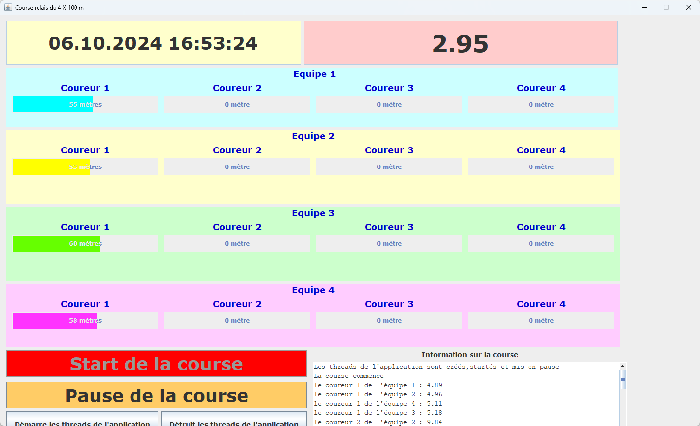

# 1-Thread_synchrone
Voici un aperçu de l'application Java TTThread :

## Tâches à effectuer
Par groupe de deux apprenti(e)s, réalisez les tâches suivantes :

1. Récupérer le projet en réalisant un clone 
2. Ouvrir et étudier le projet EA fourni (projet_coursethreadée.qea)
3. Tester le programme fourni et visualiser les Thread exécutés dans NetBeans
4. Réaliser votre propre JAVADoc dans le code
5. Dans le chapitre <<Tests technologiques>> de votre documentation de projet, votre travail doit y être intégré et expliqué
